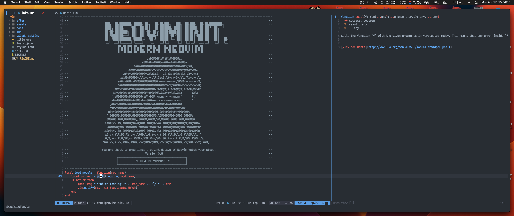
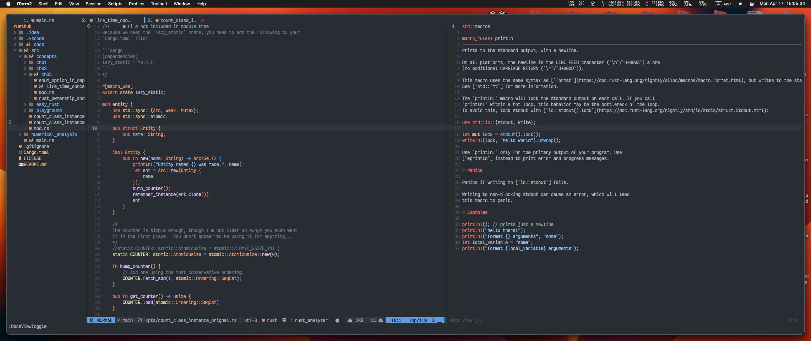

# MODERN NVIM CONFIG

<!-- vim-markdown-toc Marked -->

* [ChangingLog](#changinglog)
    * [V.0.9.2 Release Nvim](#v.0.9.2-release-nvim)
    * [v.0.9.1 Release Nvim](#v.0.9.1-release-nvim)
    * [v.0.9.0 Release Nvim 0.9 with Lazy](#v.0.9.0-release-nvim-0.9-with-lazy)
    * [v.0.8.0 Update release Nvim-workflow v0.1](#v.0.8.0-update-release-nvim-workflow-v0.1)
* [Nvim Workflow](#nvim-workflow)
    * [Shortcuts](#shortcuts)
* [Workflow notes](#workflow-notes)
    * [Cargo with Rust](#cargo-with-rust)
    * [Auto Save](#auto-save)
    * [For development](#for-development)
* [More details for the configurations](#more-details-for-the-configurations)
* [To do](#to-do)
* [Major Changes in Nvim 0.8](#major-changes-in-nvim-0.8)
* [General Configuration helper](#general-configuration-helper)
* [USEFUL COMMANDS](#useful-commands)
* [Jump Motion](#jump-motion)
    * [Things to be considered](#things-to-be-considered)
    * [Migration for Nvim 0.8](#migration-for-nvim-0.8)
    * [Nvim with Lua API](#nvim-with-lua-api)
    * [For mapping keyboard](#for-mapping-keyboard)
    * [Telescope commands](#telescope-commands)
    * [Events managment in nvim](#events-managment-in-nvim)
    * [Make statusline from scratch](#make-statusline-from-scratch)
    * [Debugging in lua](#debugging-in-lua)
    * [Order of execution in nvim](#order-of-execution-in-nvim)
    * [Adding upper case (captial letter)](#adding-upper-case-(captial-letter))
* [UNDERSTANDING THE COLOR](#understanding-the-color)
* [VIM EVENTS](#vim-events)
* [MEASURE SPEED OF NEOVIM](#measure-speed-of-neovim)

<!-- vim-markdown-toc -->

## ChangingLog

### V.0.9.2 Release Nvim

- [x] This version has no issue in performance, I just included minor fixes for some libraries.
  - [x] `nvim-saga` now works flawlessly.
  - [x] `ranger` now can open in new buffer, support the icons and other features.
  - [x] `terminal`: Terminal now uses the `saga` package to open the new terminal.
  - [x] `conform`: Added formatter for both `rust` and `R` customized.
  - [x] `gen.nvim`; Added AI with LLM language models support - model are locally installed.

### v.0.9.1 Release Nvim

- [x] The following major realse shows a bit longer time to trigger the `nvim`.

### v.0.9.0 Release Nvim 0.9 with Lazy

- [x] Working on the `nvim 0.9` modern APIs.
- [x] The current version works under `nvim`
      with Lazy Plugins Manager.
- [x] Startup time is under `20 milliseconds` for all the installed plugins.
- [x] Added `which-key` for mapping all the available `keys`.
- [x] Refactoring and optimizing the workflow structure.
- [x] Added session harboon designed for productivity.
- [x] Added original function for launching `autoload`-`netrwPlugin`-
- [x] Changed the nvim-web-devicons customized based on our requested color
      ([Read here](./docs/IconsColor.md))
- [x] Added a color theme plugin created from scratch namely `github.nvim` theme.
- [x] Add more support for the debugging session with `which-key` integration.
      Also added `virtual-text` supprot in the `dap` session to show the value of
      the variable [check here](./docs/debugging_adapgers.md).
- [x] adding more advanced topic here.

### v.0.8.0 Update release Nvim-workflow v0.1

As `nvim` has been updated to version `0.8`, which includes a stable release,
several deprecated third-party plugins and APIs have also been optimized. As a
result, the startup time has been reduced from 800 milliseconds to only 18
milliseconds. With this optimization, `nvim` is now faster than light while
maintaining backwards compatibility with some outdated plugins that are
essential to my daily workflow.




The configuration files are all written in `lua` using
the most modern `APIs` by this time. Check for more details `:h deprecated` to
see the news feature of the new release. Here, is a summary of the most wanted
upgrades to my configuration file (to name few)

- [x] All packages are supported for the new version of `nvim`
- [x] Startup time up to maximum 18 milliseconds tested on my `MacBook Max M1`
- [x] Support several programming languages, with their components such assets

  - LSP configured with `mason` plugin, (also support lsp-saga, lsp-signature)
  - Linting support, Auto-formatter, intelligence, auto-completions,
  - Go to definition, hover, references, troubles, actions.
  - Debugging with `nvim-dap` support several protocols and programmings adapters.
  - Dap now support the `virtualenv` type, which can trigger the adapter of the
    virtualenv to keep consistency.

- [x] Fixed the `cmp-line` support the `ctrl+j/k` for navigation.
- [x] Added boarders to the `lsp/cmp` elements
- [x] Auto-trigger `packer-plugins` when the list of plugins is upated.
- [x] `packer-plugin` is now can handle mutli-jobs for the `macbook` without freezing.
- [x] Added the support of the `tabnine` with executional compatibility for the
      `arm 64` `silicon M1` this supports the also the `virtualenv` of python.
- [x] Statusline now shows message about the `virtualenv` name, near to the
      `lsp-type` support.
- [x] Support for the colorscheme that can configure to show major highlights
  - Highlighter for the current number-line
  - Highlighter for `Statusline`
  - Highlighter for `tabs`
  - Highlighter for `git` plugin support
  - Highlighter for `linter` and the `virtual-text`
  - Highlighter for `lsp-icons` on the side gutter with different colors.
- [x] Added helper utilities/functions and documentation for debugging, development support
- [x] Upgraded the `nvim_speed_test` to gauge the speed of the startup time and evaluate the performance.
- [x] Support the `nvim-patient` for loading and caching the plugins.
- [x] Plugins triggered by certain types of events that will reduce the clutter
      and improve the speed significantly, check for example `:packer status` to
      see that majority of plugins are not loaded at the startup.

## Nvim Workflow

### Shortcuts

1. `ContextEnable`: will give you a nice folding to your functions.
2. `DocsViewToogle`: for showing documents and tracing your cursor.
3. `SymbolsOutline`: for getting a nice jump over all coding elements.
4. `<leader> + o`: will also give us similar to `SymbosOutline`.
5. Remember, once you are in insert mode, it will trigger other plugins to be
   loaded. but some of them until you open next buffer. (reason is to get speed
   and loading only necessary plugins on demands.)
6. `Ctr + n/p`: to scroll faster while center.
7. `Shift + { or }` to scroll faster while centered but jump on coding
   elements.
8. `<F6>`: To toggle the spell checking.
9. `<F1>`: To show help
10. `<leader>ff`, `<leader>fg`, `<leader>fb` and `<leader>fh` all are reserved
    to `nvim-Telelscope toggler`.
11. `<leader>tt`: horizontal terminal,
12. `<leader>t`: floating terminal but slower
13. `<leader>r`: Ranger for navigating your files.
14. `<leader>u`: undo-tree toggler.

## Workflow notes

### Cargo with Rust

To activate the `crate` plugin, you need to enter first into a buffer with
`rustfile` `*.rs`, which can be activated on the `Insert` event. This will also
trigger `cmp-create` and `nvim-crate`. You can later use the `keymapping:
gH` on the crate name, which will trigger documentation about the crate history
and other considerations.

### Auto Save

By default, the file will automatically save based on the `auto-saved` plugin.
This feature is triggered as soon as we begin writing. To stop this auto-save,
we can use the keymapping `leader` + 's', which will prevent further automatic
saves.

### For development

We can use add the following to the top of the file

```lua
require("core.myInspectorFucntions")
```

to reguest the necessary `custom-development` functions that I created.
Then, for development you can use this as an example

- assume you have a file called `testing_file` at the `lua` directory

```lua
local fn = require("testing_file")
P(fn.setup())
```

## More details for the configurations

## To do

- [x] Configuration for the dap
- [install dap for rust-analyzer, integrated with rust-tools](https://github.com/alpha2phi/neovim-for-beginner/blob/50-package-manager/lua/config/lsp/installer.lua)
- [x] Adding only the `keymapping-window`.
- [x] spell-checking for nvim such as
- [Spelunker.vim](https://github.com/kamykn/spelunker.vim)
  The current configurations are from the needs of getting the best optimized `IDE` for
  the startup time.

## Major Changes in Nvim 0.8

- [x] [Major Changes in nvim 0.8](https://jdhao.github.io/2022/10/05/nvim-v08-release/)
- [x] [New LSP Features in Neovim 0.8](https://www.reddit.com/r/neovim/comments/xt1tj2/new_lsp_features_in_neovim_08/)
- [x] [Deprection of lsp_installer.on_server_ready()](https://github.com/williamboman/nvim-lsp-installer/discussions/6360)
- [x] [Introduction mason.nvim](https://www.reddit.com/r/neovim/comments/w6w5ij/introducing_masonnvim/)
- [x] [How to configure LSP with mason](https://github.com/williamboman/mason.nvim/discussions/92#discussioncomment-3173425)

## General Configuration helper

- [configure nvim using lua](https://icyphox.sh/blog/nvim-lua/)

## USEFUL COMMANDS

The following command are super handy and useful when developign `lua` plugins.

```lua
:source %                  -- This will repload the curretn buffer (usually can be used with init.lua)
:lua <function_name()>     -- How to run a function (especially the __G.) global functions (check special function file)

```

1. Packer and packadd

- `packer` usually will load the required plugins and thats suppose to be for
  any file you will put at `plugin` which where packer usually dumps its
  contents.

2. Color-scheme

- Any color scheme (\*.vim) will be put at `colors` directory inside the `nvim`
  will be loaded to the color-scheme, which can be checked using `:colorscheme <tab>`

3. RUNTIME PATH

- You can use `:set rtp+=/path/to/emmet` to add any directory which will be
  loaded to the `run-path` lists.

4. Getting some useful Info

```lua
:lua print(vim.opt.columns:get()) -- will print the number of columns you have (set/get are main functions to retervie or setting info)
```

- [Read Useful Information](https://github.com/j-hui/fidget.nvim/blob/main/lua/fidget.lua)

5. Since 0.8 we can now create

```vim
vim.cmd [[
  autocmd BufEnter,CursorHold,InsertLeave,BufWritePost *.rs silent! lua vim.lsp.codelens.refresh()
]]
```

Now, it becomes as:

```lua
vim.api.nvim_create_autocmd({ "BufWritePost", "BufEnter", "CursorHold", "InsertLeave" }, {
  pattern = { "*.rs" },
  callback = function()
    vim.lsp.codelens.refresh()
  end
})
```

6. undotree hint Since we allow `undotree` to be triggered only when we call
   the undotree kepmapping, then you should always hit at least once the
   `undotree` to trigger it for the curretn buffer, which can keep tracking the
   changes.

## Jump Motion

Read more here:

- [Nvim Motion](https://alpha2phi.medium.com/neovim-for-beginners-motion-4553e3c06818)

1. vim-easymotion, vim-sneak, hop.nvim, lightspeed.nvim, pounce.nvim,
   vim-searchx

### Things to be considered

- [x] Use the color-scheme form `NVChad`.
- [x] optimized with the `lazy loading` based on packer configuration .
- [x] remove the unnecessary packages form loading that comes with `nvim`.
- [x] Adding the lsp compatibility configuraition skippers for regualr `lsp` vs `rust-tools`.
- [x] Adding the virtual text lsp configruration.
- [x] Refactoring all the crrent lsp files into more moduels follow the other way of writing.
- [x] Using Nvim v.0.8
- [x] Adding symboles inspector for the right corner.
- [x] `cmd` and `/:` should works
- [x] Spelling completion.
- [x] `LSP` configurations advanced, including highlighting and other optimizations
- [x] Rust-tools and analyzer for complete configurations.

### Migration for Nvim 0.8

check `:h deprecated`

- [x] Need to change vim.highlight.create into vim.create.hl.
- [x] `compatibility` changed to `compatibility_vim`. : read more about this refactoring later.
- [x] `vim.lsp.buf.format()` now replaces the `vim.lsp.buf.formatting()`

### Nvim with Lua API

- [pretty_print](https://github.com/max397574)

```shell
vim.pretty_print("")
```

### For mapping keyboard

there are two `apis`

- [x] got it from the telescope
- [telescope configuration](https://github.com/vzytoi/nvim.lua/blob/main/lua/plugins/telescope.lua)

```lua
local map = function(op, outer)
    outer = outer or { silent = true, noremap = true }
    return function(lhs, rhs, opts)

        if type(lhs) ~= "table" then
            lhs = { lhs }
        end

        opts = vim.tbl_extend("force",
            outer,
            opts or {}
        )

        for _, v in pairs(lhs) do
            vim.keymap.set(op or "n", v, rhs, opts)
        end

    end
end

vim.g.nmap = map("n")
vim.g.imap = map("i")
vim.g.vmap = map("v")
vim.g.tmap = map("t")

```

which means using `vim.keymap.set()`

- [x] Using reqular nvim

```shell
vim.api.nvim_set_keymap("i", "<c-j>", '("<C-n>")', {
	noremap = true,
	silent = true,
	expr = true,
})

```

### Telescope commands

In the `cmd` you can use

```shell
:Telescope keymaps, registers, vim_options, jumplist, loclist, filetypes ..etc.

```

- [Check Vim Pickers](https://github.com/nvim-telescope/telescope.nvim#layout-display)

### Events managment in nvim

There are several ways to manage the `events` such as VimEnter, BufEnter ... etc. Read more here

- [Vim documentation: autocmd](http://vimdoc.sourceforge.net/htmldoc/autocmd.html#autocmd-events)

### Make statusline from scratch

```lua
local function status_line()
  local mode = "%-5"
  local file_name = "%-.16t"
  local buf_nr = "[%n]"
  local modified = " %-m"
  local file_type = " %y"
  local right_align = "%="
  local line_no = "%10([%l/%L%)]"
  local pct_thru_file = "%5p%%"
  vim.cmd([[hi StatusLine ctermbg=red ctermfg=yellow ]])

  return string.format(
    "%s%s%s%s%s%s%s%s",
    mode,
    file_name,
    buf_nr,
    modified,
    file_type,
    right_align,
    line_no,
    pct_thru_file
  )
end
vim.opt.statusline = status_line()

```

- To add color to `status-line` we can use the following, Go to the
  `one-darker` configuration file and add the following which can alter the group
  color of the `statusline`

```lua
     -- StatusLine
      StatusLine = { fg = '#DADFF7' ,bg = '#008DD5' },
     -- StatusLineTerm = {},
     -- StatusLineNC = {},
     -- StatusLineTermNC = {},
```

### Debugging in lua

In command line prompt for `nvim` you can print the tables using one of the following.

```lua
:lua vim.pretty_print(packer_plugins)
:lua print(vim.inspect(packer_plugins))
```

### Order of execution in nvim

Anything you put inside the `plugin` (without a trailing 's'), which is located
in the same directory as where `nvim-packer` stores its `startup`, will be used
to load the `nvim configuration`. It's useful to understand the directory order
for placing your configurations files to improve startup speed.

- [x] Create a `test.lua` file at the plugin directory for automatic sourcing.
- [x] You can put any code inside this `test.lua` that will be loaded and
      executed after all Lua files are sourced.
- [x] Note that the `packer-plugins` global variable is established after
      sourcing the `packer_compiled.lua`. It checks for a plugin called `undotree`
      (same as from the GitHub repository). This will automatically get loaded when
      you open the `init.lua` file.

```lua
if packer_plugins["undotree"] and packer_plugins["undotree"].loaded then
print("Vim undotree is loaded")
-- other custom logic
end

print("wow")

```

```lua
 ├──     LICENSE
 ├──     README.md
 └──     VSCode_setting/
 │  ├────     README.md
 │  ├────     SS-01.png
 │  └────     init.vim
 └──     assets/
 │  ├────     SS-01.old
 │  ├────     SS-01.png
 │  ├────     SS-02.png
 │  ├────     SS-03.png
 │  ├────     SS-04.png
 │  └────     current_loaded_programming_langauge_servers.png
 ├──     init.lua
 └──     lua/
 │  └────     core/
 │  │  ├────     global.lua
 │  │  ├────     init.lua
 │  │  └────     keymappings.lua
 │  └────     plugins/
 │  │  └────     configs/
 │  │  │  ├────     init.lua
 │  │  │  ├────     myFzf.lua
 │  │  │  ├────     myImpatient.lua
 │  │  │  ├────     myNvimTree.lua
 │  │  │  ├────     myTelescope.lua
 │  │  │  ├────     myUndoTreeConfig.lua
 │  │  │  └────     onedark_config.lua
 │  │  ├────     init.lua
 │  │  ├────     packerPluginsManager.lua
 │  │  └────     packerPluginsManagerLoader.lua
 │  └────     settings/
 │  │  ├────     init.lua
 │  │  └────     options.lua
 └──     plugin/
 │  ├────     packer_compiled.lua
 │  └────     test.lua
```

Read more here

- [Plugin Layout in the Dark Ages](https://learnvimscriptthehardway.stevelosh.com/chapters/42.html)

### Adding upper case (captial letter)

-- This will work if you add to (common) for the color scheme.
-- Defing first the synatx group by linking them to existed on using:
-- highlight def link <you_custom_group_name> guifg=<hash-color-name>
-- Then assign to the specific pattern that you want to highlight

```shell
vim.cmd([[
hi def link GGX Title
syn match GGX /[A-Z]+/
syn match GGX /[A-Z]\{2,\}/ "two words or more
syn match GGX "\v<[A-Z]+>"
]])

```

You can also specify some highlight using:

```shell
vim.cmd([[highlight Visual cterm=bold ctermbg=Blue ctermfg=NONE]])
```

There are three ways to highlight custom group (group created by user) these are

1. Using direct nvim syntax

```vim
highlight GGX guifg=#EEEDBF
```

2. Adding to the `one-dark-config.lua` file at the defined highlights like:
   Here we will add `GGX`

```lua
highlights = {
-- Common
Visual = { bg = '$bright_orange', fmt = 'bold'},
Normal = { fg = '$beautiful_black' ,bg = '$beautiful_black' },                               -- backgorund default color
Terminal= { fg = '$beautiful_black' ,bg = '$beautiful_black' },                              -- terminal color for nvim
EndOfBuffer = { fg = '$beautiful_black' ,bg = '$beautiful_black' },                          -- End of buffer color
VertSplit = { fg = '$light_green' ,bg = '$beautiful_black' },                                -- when using vertical split
SignColumn = { fg = '$beautiful_black' ,bg = '$beautiful_black' },                           -- SignColumn control the edge of nvim buffer
-- Syntax
String = {fg ='$light_green'},                                                               -- For only string in nvim
-- nvim-tree
NvimTreeVertSplit =  { fg = '$light_green' ,bg = '$beautiful_black' },                       -- When you split inside nvim-tree the fg will be activited
NvimTreeNormal = { fg = '$light_green' ,bg = '$beautiful_black' },                           -- fg means files names, folder names ..etc.
NvimTreeEndOfBuffer = { fg = '$light_green' ,bg = '$beautiful_black' },
NvimTreeGitNew = {fg ='$light_green'  },                                                      -- This will change only the
-- GGX = {fg = '#EEEDBF'}

```

3. This is native to nvim which we can use

```lua
    vim.highlight.create('GGX', {guifg="#EEEDBF"}, true)
```

We are using now `Global` function to source all the current files

```lua
-- Function used to color (yellow) the upper cases words
_G.highlight_upper_letter_cases = function()
    -- The following
    -- This will work if you add to (common) for the color scheme.
    -- Defing first the synatx group by linking them to existed on using:
    -- highlight def link <you_custom_group_name> guifg=<hash-color-name>
    -- Then assign to the specific pattern that you want to highlight
    -- You can link from other group using:
    -- vim.api.nvim_command([[hi def link GGX Title]])
    -- Or create a new group
    --vim.highlight.create('GGX', {guifg="#EEEDBF"}, true)
    --vim.api.nvim_command([[highlight GGX guifg=#EEEDBF]])
    vim.api.nvim_command([[syn match GGX /[A-Z]+/]])
    vim.api.nvim_command([[syn match GGX /[A-Z]\{2,\}/]])
    vim.api.nvim_command([[syn match GGX "\v<[A-Z]+>"]])
    -- this will be executed only when open vim on event VimEnter (then source
    -- all nvim files), should not be used (affecting the markdown)
    vim.cmd([[autocmd VimEnter ~/.config/nvim/* source %]])
end
```

## UNDERSTANDING THE COLOR

In `nvim-lua` configurations, there are essentially three layers that control
the `color` of each `group`. Group colors refer to those defined for specific
actions in `nvim`, such as digits, tabs, normal mode, and backgrounds, among
others. These layers include:

- A. Default Layer (this will be native to the color-scheme that you select.
  (mostly the tree-sitter parser colors are included)
- B. Tree-Sitter Color-Groups which used once you install the `nvim-treesitter`
- C. Component of the `plugins` that alter the colors (e.g., statuline,
  bufferline, nvim-tree and lsp configurations)
- D. The user custom individual colors defined.

`Configurations` : to change the color, you need to consider to which level you
want to alter the color.

## VIM EVENTS

- [list all vim script events](https://tech.saigonist.com/b/code/list-all-vim-script-events.html)

## MEASURE SPEED OF NEOVIM

- [Speedup Neovim ](https://aca.github.io/neovim_startuptime.html)
