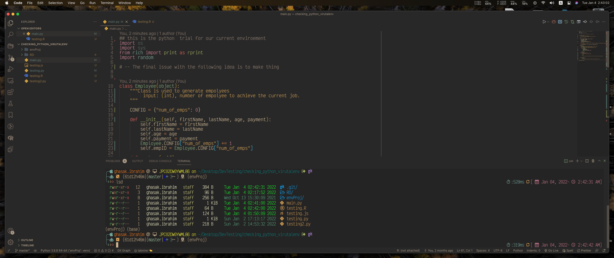

# Integrate VSCode with Neovim

There are several steps are needed to accomplish this integration. Here is a
quick summary on how to do so,



## Install VSCode Neovim plugin

Check the link Here

- [VSCode Neovim](https://marketplace.visualstudio.com/items?itemName=asvetliakov.vscode-neovim)

## Custom nvim config for vscode Only

Here, we can make this happen by adding custom configuration's path to the
`VSCode setting` also, we need to provide a link to the `nvim` which is
installed on our machine. Currently, I am using `nvim 0.6` which works
flawlessly.

- Since I installed (nvim 6.0) in a new directory called `~/dev/bin/nvim`, I
  created a symlink to point to this (nvim) Using :: (note: if you update your
  `nvim` version this symlink will be broken, so you need to create a new
  symlink to the new nvim version similarly.)

```sh
ln -s ~/dev/bin/nvim  /usr/local/bin/nvim
```

you will add the following in the `VSCode Setting file`,

## For Virtualenv or a new python

To ensure things are working you need to install `pynvim` integrated with the
python that you are working on I usuaully use:

### For Global python

```sh
python3 -m install --user --upgrade pynvim
```

### For virtualenv python

this will work for both `pipenv` or `virtualenv`

```sh
python3 -m install --upgrade pynvim
```

```sh
"vscode-neovim.neovimExecutablePaths.darwin": "/usr/local/bin/nvim",
# This one is not needed //"vscode-neovim.neovimExecutablePaths.darwin": " /Users/ghasak.ibrahim/dev/bin/nvim",
"vscode-neovim.neovimExecutablePaths.linux": "/usr/local/bin/nvim",
"vscode-neovim.neovimInitVimPaths.darwin": "$HOME/.config/nvim/VSCode_setting/init.vim"
```

## Applying Color Scheme in VSCode

Read here:

- [VSCode - How do I change the color of constants only in a javaScript? ](https://stackoverflow.com/questions/61829218/vscode-how-do-i-change-the-color-of-constants-only-in-a-javascript-file)
- [How to Create a Custom VS Code Theme (2020) | Step-by-Step | Debut of codeStack dark-theme](https://www.youtube.com/watch?v=QCqWzb-9Sy8&t=441s)
- [How to Make your own VSCode Theme!](https://www.youtube.com/watch?v=pGzssFNtWXw&t=599s)

## References

-[How to integrate python with vscode nvim](https://www.reddit.com/r/neovim/comments/i65pwd/no_python3_provider_found_run_checkhealth_provider/)


