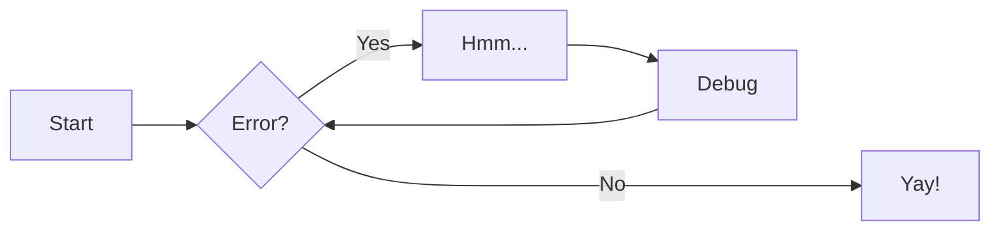
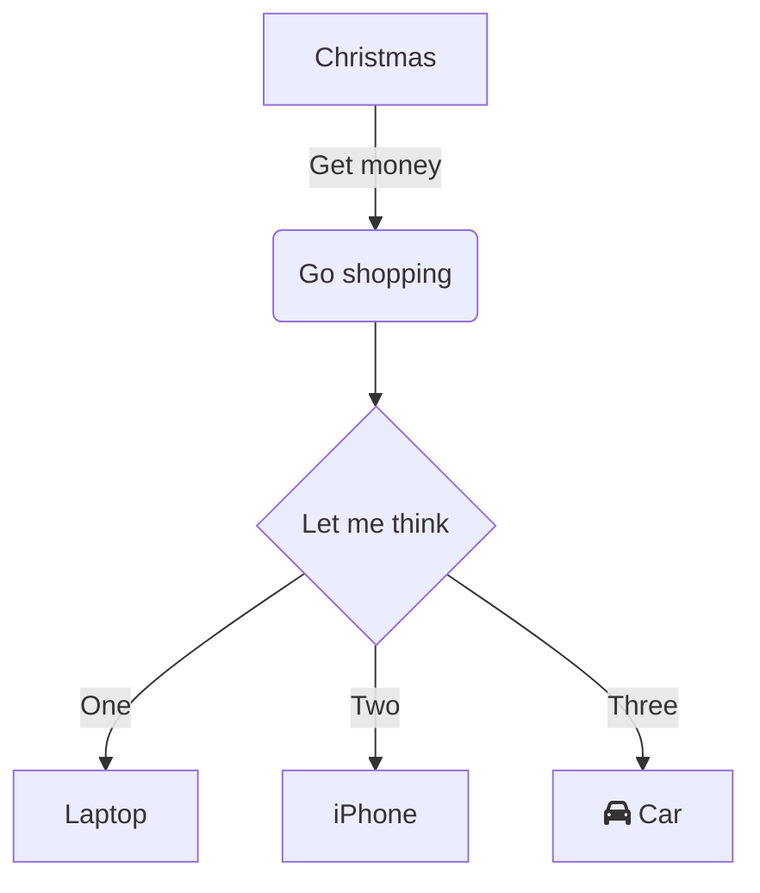

# Diagrams
Use `markdownPreview` to obtain the diagrams and the UML.

## Mermaid Diagram

```mermaid
graph LR
  A[Start] --> B{Error?};
  B -->|Yes| C[Hmm...];
  C --> D[Debug];
  D --> B;
  B ---->|No| E[Yay!];

```

```mermaid
flowchart TD
    A[Christmas] -->|Get money| B(Go shopping)
    B --> C{Let me think}
    C -->|One| D[Laptop]
    C -->|Two| E[iPhone]
    C -->|Three| F[fa:fa-car Car]
```

## PlantUML Diagram

```plantuml
Bob -> Alice : hello
```
