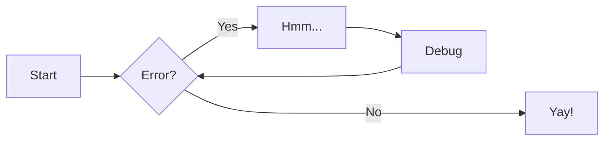

# Mermaid and PlantUML with nvim

## Intorduction

I am using the following with the `markdownPreview` for productivities.
Read more about how to use them [here](https://alpha2phi.medium.com/neovim-for-beginners-note-taking-writing-diagramming-and-presentation-72d301aae28)

## Template to use

### Mermaid Diagram



### PlantUML Diagram

```plantuml
Bob -> Alice : hello
```

